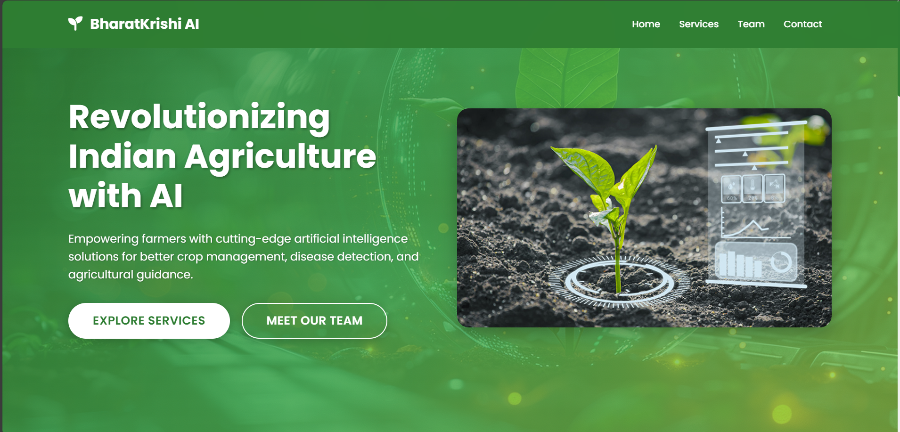
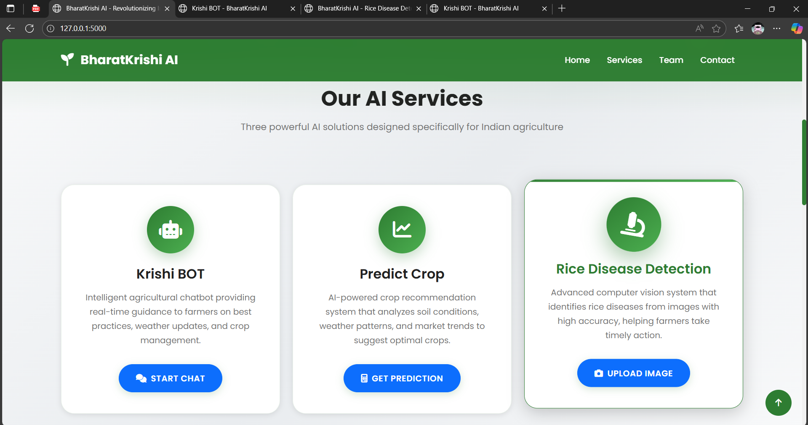
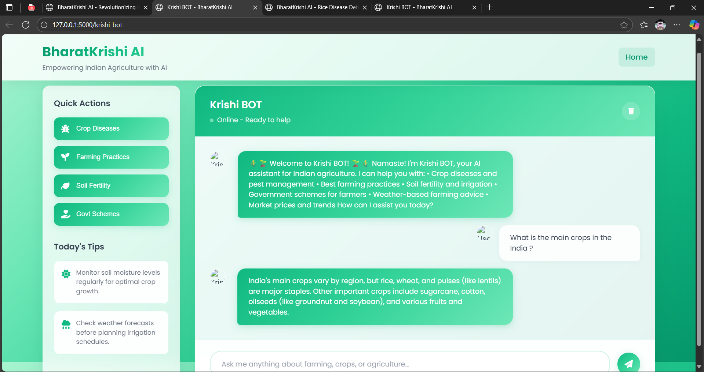
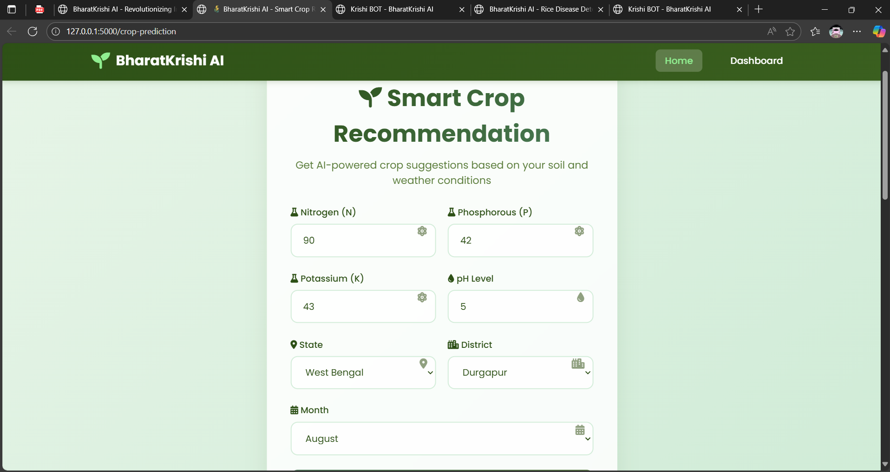

# 🌾 BharatKrishi AI - Intelligent Agricultural Advisory System

## 📋 Project Overview

**BharatKrishi AI** is an intelligent agricultural advisory system that leverages Artificial Intelligence and Machine Learning to provide timely, localized, and expert guidance to India's small and mid-sized farmers. This comprehensive solution addresses critical agricultural challenges through three integrated AI-powered services.

---

## 🎯 Problem Statement

Despite being a major agricultural economy, India's small and mid-sized farmers face significant productivity challenges due to lack of timely, localized, and expert guidance. Key decisions like crop selection, disease control, and farm management are often based on guesswork or outdated knowledge. This leads to:

- **Reduced crop yields** due to suboptimal crop selection
- **Economic losses** from preventable diseases and pests
- **Inefficient resource utilization** in farming practices
- **Limited access** to expert agricultural knowledge
- **Delayed decision-making** affecting crop cycles

---

## 🚀 Solution: AI-Powered Agricultural Intelligence

We developed an integrated AI/ML-based system that provides comprehensive agricultural guidance through three specialized services:

### 1. 🤖 **Krishi BOT - Intelligent Agricultural Assistant**
- **Advanced AI Chatbot** powered by LangChain and Google Generative AI
- **Real-time agricultural guidance** on farming practices, crop management, and best practices
- **Multi-source knowledge base** including websites, PDF documents, and agricultural databases
- **Fallback mechanism** with local agricultural knowledge for offline functionality
- **Natural language processing** for intuitive farmer interaction

### 2. 🌱 **Crop Prediction System**
- **Machine Learning Model** trained on comprehensive agricultural datasets
- **Weather-integrated predictions** using OpenWeatherMap API
- **Soil and climate analysis** for optimal crop recommendations
- **Real-time weather data** integration for accurate predictions
- **User-friendly interface** for easy input and result interpretation

### 3. 🔍 **Rice Disease Detection**
- **Deep Learning Model** using TensorFlow/Keras for image classification
- **Real-time disease identification** from uploaded plant images
- **Comprehensive disease database** covering common rice diseases
- **Preventive measures and treatment recommendations**
- **High-accuracy detection** for early intervention

---

## 🎯 Sustainable Development Goals (SDGs) Alignment

### **SDG 2: Zero Hunger**
This project directly contributes to **Sustainable Development Goal 2: Zero Hunger** by:

- **Increasing agricultural productivity** through AI-driven crop recommendations
- **Reducing crop losses** via early disease detection and prevention
- **Improving food security** by optimizing farming practices
- **Supporting small-scale farmers** with accessible technology
- **Promoting sustainable agriculture** through informed decision-making

---

## 🏗️ Technical Architecture

### **Unified Flask Web Server**
- **Single integrated platform** hosting all three services
- **RESTful API endpoints** for seamless service communication
- **Responsive web interface** accessible on multiple devices
- **Modular design** for easy maintenance and scalability

### **Technology Stack**
- **Backend**: Python Flask, TensorFlow, PyTorch
- **AI/ML**: LangChain, Google Generative AI, HuggingFace
- **Frontend**: HTML5, CSS3, JavaScript
- **APIs**: OpenWeatherMap, Agricultural Databases
- **Data Processing**: Pandas, NumPy, Scikit-learn

---

## 👥 Team Information

### **Project Team**

| Role | Name | 
|------|------|
| **Team Leader** | Deep Rudra | 
| **Team Member 1** | Tanmay Debnath | 
| **Team Member 2** | Debtanu Chaudhuri  | 
| **Team Member 3** | Susanta Sing | 
| **Team Member 4** | Lutfar Rahman | 
| **Team Member 5** | Tanmay Das | 


---

## 📁 Project Structure

```
BharatKrishi AI/
├── unified_server.py          # Main Flask server
├── requirements.txt           # Python dependencies
├── index.html                # Main landing page
├── static/                   # Static assets
│   ├── css/
│   ├── js/
│   └── images/
├── Crop Prediction/          # Crop prediction service
│   ├── app.py
│   ├── model/
│   └── templates/
├── Krishi BOT/              # AI chatbot service
│   ├── app.py
│   ├── static/
│   ├── templates/
│   └── fallback_data.py
└── Rice Disease Detection/   # Disease detection service
    ├── app.py
    ├── model/
    └── templates/
```

---

## 🚀 Getting Started

### **Prerequisites**
- Python 3.10 or higher
- Required Python packages (see `requirements.txt`)

### **Installation**
1. Clone the repository
2. Install dependencies:
   ```bash
   pip install -r requirements.txt
   ```
3. Run the unified server:
   ```bash
   python unified_server.py
   ```
4. Access the application at `http://localhost:5000`

---

## 📊 Features & Capabilities

### **Krishi BOT Features**
- ✅ Real-time agricultural Q&A
- ✅ Multi-language support capability
- ✅ Offline fallback functionality
- ✅ Context-aware responses
- ✅ Agricultural best practices guidance

### **Crop Prediction Features**
- ✅ Weather-based crop recommendations
- ✅ Soil parameter analysis
- ✅ Seasonal crop planning
- ✅ Yield optimization suggestions
- ✅ Climate adaptation strategies

### **Disease Detection Features**
- ✅ Real-time image analysis
- ✅ Multiple disease classification
- ✅ Treatment recommendations
- ✅ Prevention strategies
- ✅ Early detection alerts

---

## 📈 Impact & Benefits

### **For Farmers**
- **Increased productivity** through optimized crop selection
- **Reduced losses** via early disease detection
- **Cost savings** from better resource management
- **Access to expert knowledge** 24/7
- **Improved decision-making** with data-driven insights

### **For Agriculture Sector**
- **Digital transformation** of traditional farming
- **Knowledge democratization** for small farmers
- **Sustainable farming practices** promotion
- **Technology adoption** in rural areas
- **Food security enhancement**

---

## 🔬 Learning & Development

This project was developed as part of the **IBM AI/ML Internship Program**, providing hands-on experience in:

- **Machine Learning Model Development**
- **AI Integration and Deployment**
- **Full-Stack Web Development**
- **API Development and Integration**
- **Agricultural Technology Applications**
- **Sustainable Development Solutions**

---

## 📚 Documentation & Resources

### **Project Documentation**
- [Project Report](#) *(To be uploaded)*
- [Technical Documentation](#) *(To be uploaded)* 
- [User Manual](#) *(To be uploaded)*

### **Presentations**
- [Project Presentation](#) *(To be uploaded)*
- [Demo Videos](#) *(To be uploaded)*

### **Project Screenshots**


Here are the screenshots showcasing the different components of BharatKrishi AI:

#### 🖥️ **Main Interface - Part 1**

*Primary user interface showcasing the integrated agricultural advisory system*

#### 🖥️ **Main Interface - Part 2**

*Secondary interface view demonstrating the comprehensive features of the system*

#### 🤖 **Krishi BOT Interface**

*Intelligent AI-powered agricultural assistant providing real-time guidance to farmers*

#### 🌱 **Crop Prediction System**

*Machine learning-based crop recommendation system with weather integration*

#### 🔍 **Rice Disease Detection**

*Deep learning model for real-time rice disease identification from plant images*


---

## 🤝 Contributing

This project was developed as part of an educational initiative. For questions or collaboration opportunities, please contact the team leader.

---

## 📄 License

This project is developed for educational and research purposes as part of the IBM AI/ML Internship Program.

---

## 🙏 Acknowledgments

- **IBM** for providing the AI/ML internship opportunity
- **Agricultural experts** for domain knowledge validation
- **Open-source community** for various libraries and tools
- **Farmers and agricultural communities** for inspiration and feedback

---

## 📞 Contact Information

**Team Leader**: Deep Rudra  
**Email**: deeprudradr@gmail.com 
**Project Repository**: [Repository Link]

---

*"Empowering farmers with AI-driven insights for a sustainable agricultural future"* 🌾🤖 
